# 🩺 Doctor-Patient Communication Analyzer

> Multi-modal AI framework for empirical scoring of clinical communication quality.
> Built as a PhD-level HCI research prototype — Saint Louis University, Prof Min Choi.

---

## Architecture



---

## What It Does

Analyzes a YouTube doctor-patient consultation video and produces an **empirically grounded communication score** — not an AI opinion. The LLM explains the score. It cannot change it.

---

## Scoring Framework

Two peer-reviewed frameworks anchor every score:

| Framework | Role |
|-----------|------|
| **Calgary-Cambridge** (Kurtz & Silverman, 1996) | Defines *what* to measure and clinical weights |
| **TOPSIS** (Hwang & Yoon, 1981) | Defines *how* to score empirically |

```
normalized  = |value − worst| / |ideal − worst| × 100
d+          = √Σ (weight × (normalized − 100))²
d−          = √Σ (weight × normalized)²
final score = d− / (d+ + d−) × 100
```

The score is computed before the LLM is called. `feedback["overall_score"]` is overwritten to `topsis["topsis_score"]` — immutably.

### Calgary-Cambridge Dimensions

| Dimension | Metric | Weight |
|-----------|--------|--------|
| Rapport Building | Eye contact % | 25% |
| Gathering Information | Turn balance | 25% |
| Information Giving | Filler word count | 20% |
| Non-Verbal Communication | Nodding events | 15% |
| Initiating Session | Patient response latency | 15% |

---

## Version History

| Version | Key Changes |
|---------|-------------|
| **v1** | Groq Whisper transcription + heuristic diarization (~60% accuracy) |
| **v2** | MediaPipe FaceMesh + TOPSIS + Calgary-Cambridge scoring + Quick/Research modes |
| **v3** | PyAnnote 3.1 diarization + WAV audio + 3-strategy merge + 4-signal speaker ID |
| **v4** | 5 new metrics + session state score fix + transcript removed |

### v4 New Metrics

| Metric | What It Measures |
|--------|-----------------|
| Empathy Score | Doctor warmth + tone via Groq Llama (0–100) |
| Patient Engagement | Words/turn, elaboration ratio, voluntary questions |
| Hesitation Windows | Patient pauses ≥ 2s flagged with severity + context |
| Brow Furrow Index | % frames with furrowed brows — patient confusion signal |
| Session Arc | First half vs second half patient speech ratio |

---

## Stack

| Component | Tool | Purpose |
|-----------|------|---------|
| Video download | yt-dlp | YouTube acquisition |
| Audio extraction | FFmpeg | MP3 + WAV from video |
| Visual analysis | MediaPipe FaceMesh | 468-point facial landmarks |
| Transcription | Groq Whisper Large V3 | Speech-to-text (cloud) |
| Diarization | PyAnnote 3.1 | Speaker separation (local, MPS) |
| Scoring | TOPSIS + Calgary-Cambridge | Empirical multi-criteria scoring |
| Feedback | Groq Llama 3.3 70B | Clinical coaching + empathy scoring |
| Frontend | Streamlit | Quick + Research view modes |

---

## Setup

### Requirements

```
Python == 3.11        (not 3.12 — MediaPipe incompatible)
protobuf == 3.20.3    (not 4.x — breaks MediaPipe)
```

### Install

```bash
conda create -n docpat python=3.11 -y
conda activate docpat

pip install protobuf==3.20.3
pip install mediapipe==0.10.7
pip install opencv-python streamlit numpy requests plotly yt-dlp
pip install torch torchvision torchaudio
pip install pyannote.audio
```

### Verify

```bash
python -c "
import sys, google.protobuf, mediapipe, torch
print('Python:   ', sys.version[:6])
print('Protobuf: ', google.protobuf.__version__)
print('MPS:      ', torch.backends.mps.is_available())
fm = mediapipe.solutions.face_mesh.FaceMesh()
fm.close()
print('FaceMesh: OK ✅')
"
```

### Run

```bash
conda activate docpat
streamlit run app_v4.py
```

---

## API Keys

| Key | Source | Purpose |
|-----|--------|---------|
| Groq API `gsk_...` | [console.groq.com](https://console.groq.com) | Whisper + Llama |
| HuggingFace `hf_...` | [huggingface.co](https://huggingface.co) → Settings → Tokens | PyAnnote |

Accept model terms at:
- `huggingface.co/pyannote/speaker-diarization-3.1`
- `huggingface.co/pyannote/segmentation-3.0`

---

## Common Errors

| Error | Fix |
|-------|-----|
| `'MessageFactory' object has no attribute 'GetPrototype'` | `pip install protobuf==3.20.3 --force-reinstall` |
| `ValidatedGraphConfig Initialization failed` | `conda activate docpat` (must be Python 3.11) |
| Wrong Doctor/Patient labels | Click **🔄 Swap Doctor ↔ Patient** in sidebar |
| Different score in Quick vs Research mode | Use v4 — session_state fix included |

---

## References

- Kurtz, S. & Silverman, J. (1996). The Calgary-Cambridge Referenced Observation Guides. *Medical Education*, 30(2), 83–89.
- Hwang, C.L. & Yoon, K. (1981). *Multiple Attribute Decision Making*. Springer-Verlag.
- Bredin, H. et al. (2021). End-to-end speaker segmentation for overlap-aware resegmentation. *Interspeech 2021*.
- Radford, A. et al. (2022). Robust Speech Recognition via Large-Scale Weak Supervision. *(Whisper)*

---

*v4 · Groq Whisper (MP3) + PyAnnote (WAV · Mac M1 MPS) + Groq Llama 3.3 70B · TOPSIS + Calgary-Cambridge*
