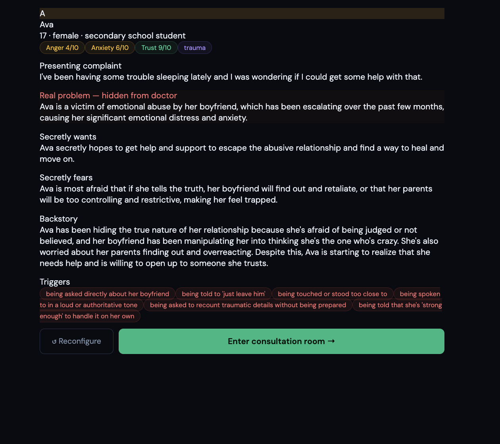
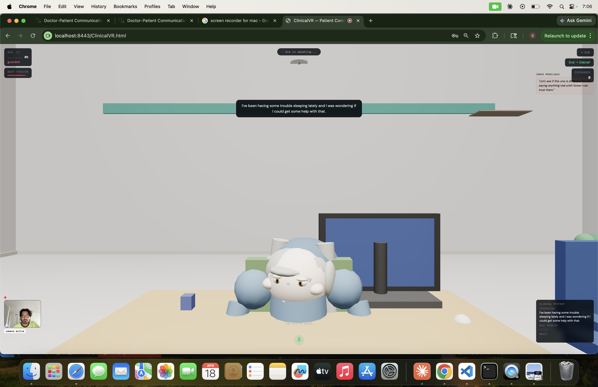
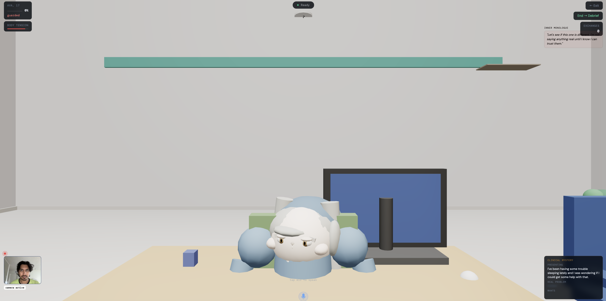
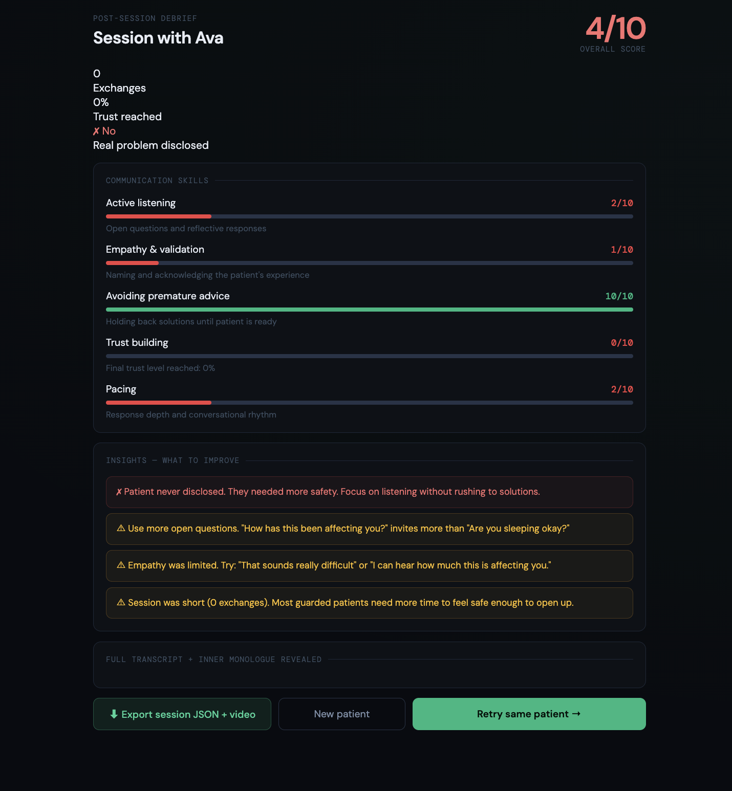

# 🏥 ClinicalVR — Patient Communication Simulator

An immersive browser-based VR simulation for training clinical communication skills.
Built with Three.js + Groq LLM. No headset required.

> Built as a research prototype — Saint Louis University, Prof. Min Choi, GXR Lab.

---

## What It Does

A 3D patient sits across from you in a virtual consultation room.
Your webcam and mic are active. You speak. The patient responds.
Every session is scored on clinical communication quality.

---

## Screenshots

### Patient Profile — Clinical Brief


### Consultation Room — Session Active


### Full Room View


### Post-Session Debrief


---

## Key Features

- 🧠 **AI Patient** powered by Groq LLM — responds realistically
- 🎭 **Hidden clinical mystery** — real problem concealed from doctor
- 📊 **Live trust meter** — tracks patient openness in real time
- 🎙️ **Voice interaction** — speak naturally via microphone
- 📹 **Webcam active** — immersive first-person consultation feel
- 📋 **Post-session debrief** — scored on 5 communication dimensions
- 🔄 **Retry or new patient** — practice different scenarios

---

## Scoring Dimensions

| Dimension | What It Measures |
|---|---|
| Active Listening | Open questions and reflective responses |
| Empathy & Validation | Naming and acknowledging patient experience |
| Avoiding Premature Advice | Holding back solutions until patient is ready |
| Trust Building | Final trust level reached |
| Pacing | Response depth and conversational rhythm |

---

## Stack

| Component | Tool |
|---|---|
| 3D Environment | Three.js |
| AI Patient | Groq LLM |
| Voice Input | Web Speech API |
| Frontend | Vanilla HTML/CSS/JS |
| Server | Python (HTTPS localhost) |

---

## Setup

```bash
# Clone the repo
git clone https://github.com/SurrajKumar2000/Doctor-Patient-Analyzer.git
cd Doctor-Patient-Analyzer/clinical-vr

# Run the server
bash start.sh
```

Open browser at `https://localhost:8443/ClinicalVR.html`

---

## API Keys Required

| Key | Source |
|---|---|
| Groq API `gsk_...` | console.groq.com |
